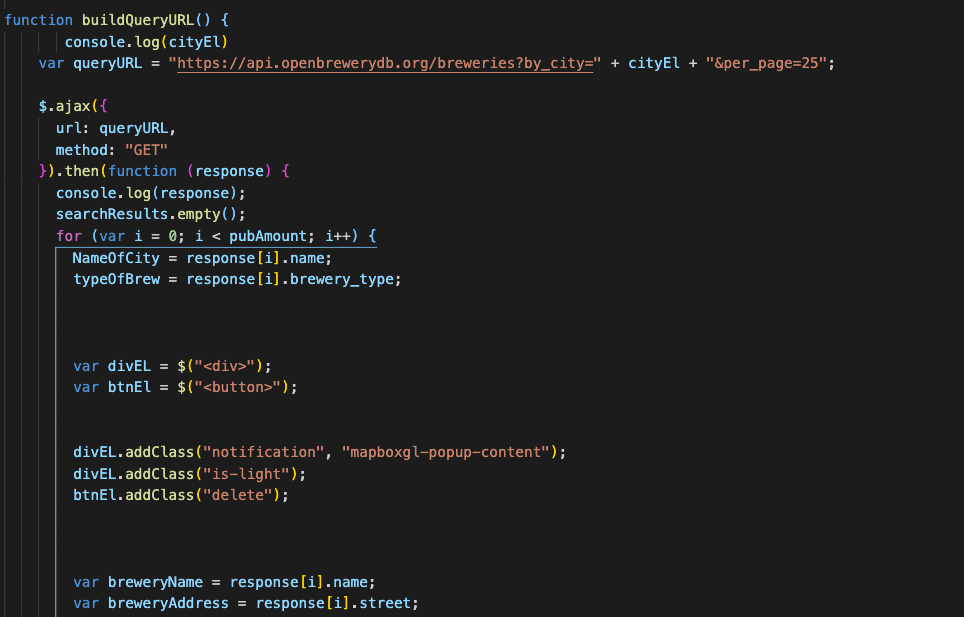
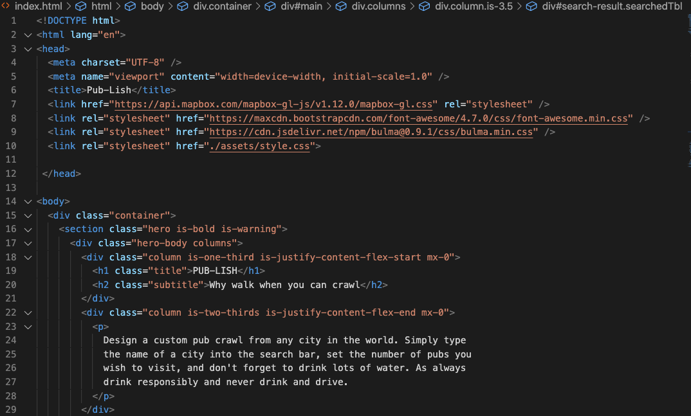

# Pub-Lish
## Description 
No matter where your next vacation is a brewery crawl can be at your fingertips.  Traveler trends are showing an increase in local experiences that are possible even during COVID.  Get growlers to go, or mask up to stay and sample all the differnt local brews.  Join the conversation to learn about different brewery methods while you sit safely on a patio.  Build your pub crawl in a new city, or in your own hometown as you support local businesses. Imagine all of this while getting to relax with a cold pint in hand.   

## Requirements 
  * Application uses at least two server-side APIs
  * Application uses client-side storage to store persistent data
  * Application doesn't use JS alerts, prompts, or confirms (uses modals instead)
  * Application uses a CSS framework other than Bootstrap
  * Application is interactive (accepts and responds to user input)

## Link to project
Pub-Lish
* [lauragwendolynburch.github.io/Pub-Lish](https://lauragwendolynburch.github.io/Pub-Lish/)

## Sample of Project 

## Sample of JavaScript

## Sample of HTML

## Features and Highlights
* Search any city in the world to find breweries locally
* Set the number of pubs you wish to see in your search
* See the names, website, and addresses of your search append to the site for you to review
* Delete any of the appened pubs that you do not wish to view
* View your search location in the mapBox, and watch the map zoom onto your selected city
* See pins drop on the map sharing the pub locations 
* Click each pin to see the name of the pub and the type of brewery 
* Refresh your page and find your last search still waiting for you

## User Notes
This was a first time colaboration for this team, and the first draft in building this site.  The goal was to start with a product at its base that is clean, functional, and user friendly. Below are some of the features we would include on future drafts.
* Ability to broaden search parameters beyond just city name. Examples being is it dog friendly, local brews only, cider houses, location to specific areas, food options, popularity, etc.
* Create a way for users to sign in and have private accounts. 
* Allow user to save multiple seaches their own account.
* Build a social community around the site where users can interact with eachother and the the pub owners.  Then allow them to give reviews, ask questions, design/share meet ups, ect.
* Add ride share information links for the private accounts to taxi/uber/lift 
* Make it possible to design searches based on distance or type of transportation.  Example being is it bike friendly, vs walking, vs ride share, etc

## Credits and API Links
Contributors to this project 
* Ali Demir
[www.github.com/alidemirbay](https://github.com/alidemirbay)
* Benjamin Domschot
[www.github.com/Bdomschot](https://github.com/Bdomschot)
* Mathew Albete
[www..github.com/mnalbete](https://github.com/mnalbete)
* Tristan Bond
[www.github.com/tbond4](https://github.com/tbond4)
* Laura Burch
[www.github.com/LauraGwendolynBurch](https://github.com/LauraGwendolynBurch)

#### Open BBrewery D
* [www.openbrewerydb.org](https://www.openbrewerydb.org/)
#### Mapbox
* [www.docs.mapbox.com/api](https://docs.mapbox.com/api/)

# License
N/A
